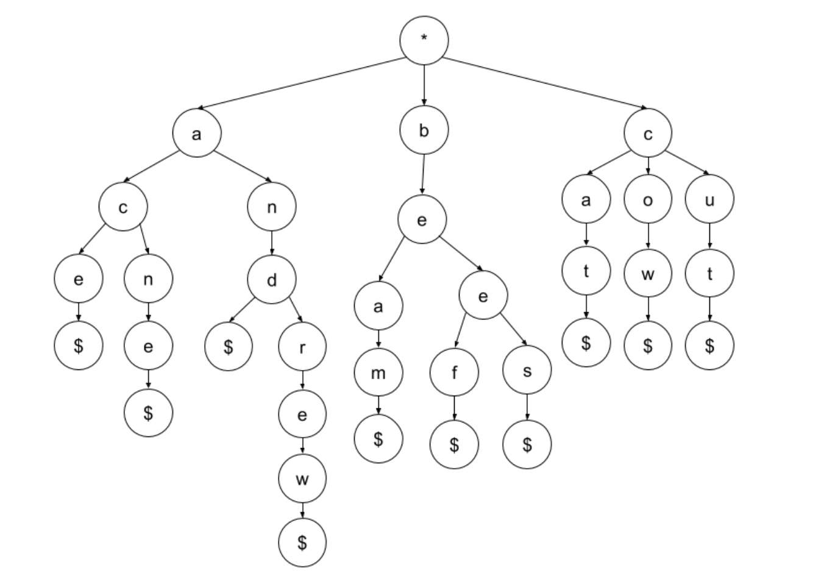
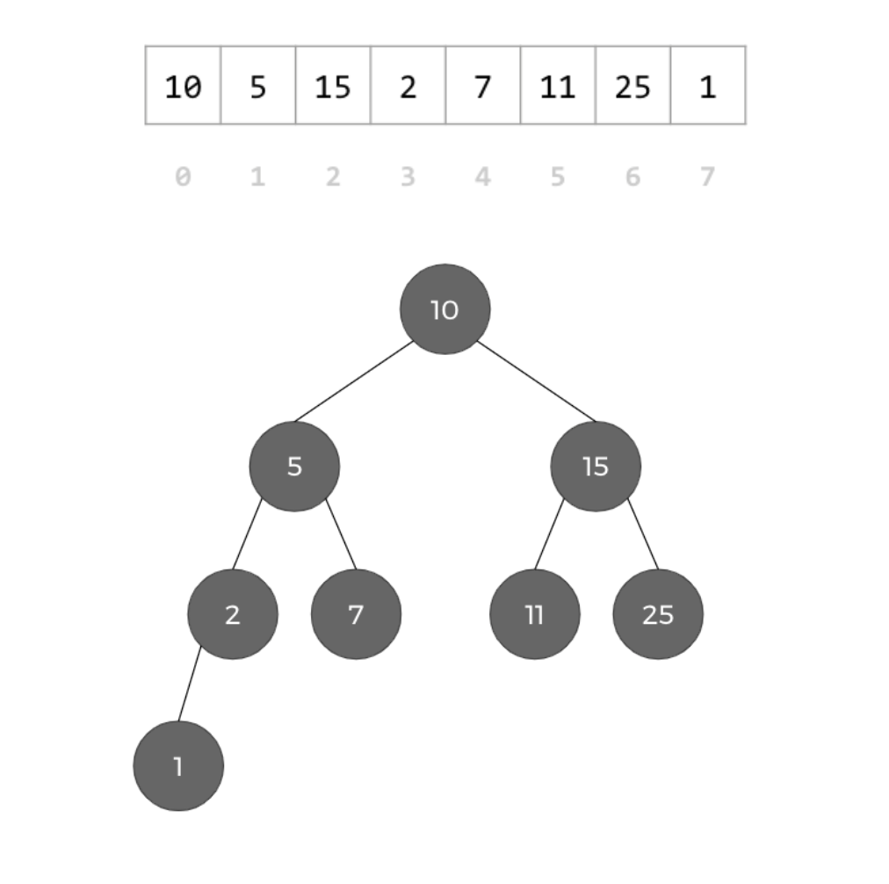

[](https://classroom.github.com/online_ide?assignment_repo_id=4599465&assignment_repo_type=AssignmentRepo)
# Project 4 - Trees

CS 3358: Data Structures and Algorithms  \
Instructor: Karen Lu \
Due 4/8/2021 11:59 pm CST


# Project Instructions

Write code for each of the below questions. Starter code for the project will be made available in a private GitHub repository when you accept the assignment invite in GitHub Classroom. Do not change the function signatures in the starter code. 

You may edit your code in whatever IDEs or text editors you prefer. For example, you may choose to: 


1. Edit and commit your files directly in the GitHub UI. This is recommended for minor changes only, as it is difficult to test code directly in GitHub. 
2. Open your files in Repl.it, an online IDE that is integrated with GitHub Classroom. Once you’ve made some changes, use the Version Control tab in Repl.it to commit and push your changes to your GitHub repository. 
3. Clone your repository locally on your computer so that you can open the code in an IDE like CLion, make commits, and push back to your remote repository.
4. Create another setup that works for you.

You must submit your final project code via Gradescope for grading. There are two ways you can do this: 


1. Select GitHub as your submission method in Gradescope, and then submit your GitHub repository directly. Please note that this may not work for some cases depending on the privacy and ownership of your repo. If this doesn’t work, use the method described below instead. 
2. Select Upload as your submission method in Gradescope. Download your GitHub repository as a ZIP file or download your Repl.it as a ZIP file, and then upload the ZIP file to Gradescope. 

Responses will be graded on three axes: correctness (as determined by autograder test cases), pseudocode and code logic, and code style. A majority of your grade is determined by how many test cases your code passes. The points awarded for each question break down as follows: 


*   Autograder Test Cases: 60%
    *   We have configured an autograder in Gradescope which will run your code against predefined test cases to check for correctness. Our autograder compiles your code using g++ (compiler invocation command) and C++11 (C++ language version). 
    *   Any solutions that try to game the test cases will receive zero credit. For example, writing an iterative algorithm when we ask for a recursive algorithm will result in zero credit for the autograder portion of the grade, even if it passes the test cases.
*   Pseudocode and Code Logic: 20% 
    *   For each question, you will be asked to write your pseudocode for your code in the comments. Writing pseudocode benefits you on two fronts: (1) it helps you plan your algorithm before you write your code, and (2) it allows us to give you credit in this category for your logic, even if the final code doesn’t pass the autograder. You may also write comments to explain your logic to the grader for any questions on which you’re having trouble. 
    *   Again, any solutions that try to game the test cases or solutions that don’t meet the requirements of the question will not receive credit. 
*   Code Style: 20% 
    *   We recommend referencing the [Google C++ Style Guide](https://google.github.io/styleguide/cppguide.html), but you do not need to follow it exactly as long as your code style is consistent and readable. 

We recommend getting started on the project early so you have time to ask questions on Piazza or in office hours in case you get stuck. We also recommend trying to submit your code on Gradescope well ahead of the deadline, even if you’re not done with all of the questions, so you can see how the autograder works and understand whether your code is passing the test cases. You may submit your code to Gradescope as many times as you like, up until the deadline. We will only grade your most recent submission. 

Please remember to follow our guidelines for academic integrity. Do not post these project questions publicly, as that is a copyright violation and a breach of the honor code.

**This project has 120 possible points and will be graded out of 100, so there is an opportunity to earn up to 120/100.**


# Part 1 - Autocomplete Tree (60 points)


## Part 1 Overview

The goal of Part 1 is to practice writing algorithms on trees with an arbitrary number of children. 

We want to create an autocomplete program, where we can provide a string `prefix`, and output a list of possible words that start with `prefix`. We do this by designing a tree where each value is a character, and traversing through the tree spells out words by collecting each character and forming strings as you traverse **depth-first**. Here is an example of one such tree:




*   This tree spells out "ace", "acne", "and", "andrew", "beam", "beef", "bees", "cat", "cow", and "cut".
*   Notice that the value in the root of the tree should be ignored when making words.
*   Notice that an extra node with a `'$'` character denotes when a word has ended.

The Tree we define here is a very basic version of a [Trie](https://en.wikipedia.org/wiki/Trie), but the same general idea we see here powers your phone's keyboard autocomplete!

We'll build out our algorithm by implementing three functions: 


1. `FindNode`, which takes in a `TreeNode` `node`, the string `prefix`, and an int `index` into `prefix`, and outputs the node we need to be at in order to start collecting elements.
2. `CollectWords`, which takes in a `TreeNode` `node`, the string `prefix`, and a string vector `results`, and updates the list with valid words.
3. `GetCandidates`, which takes in a `TreeNode` `root` and a string `prefix`, and returns a vector of all possible words that can be made starting with the letters in `prefix`.


## Part 1 Starter Code 

The starter code for this part contains the following files: 


*   <strong><code>tree_node.h</code></strong> \
A simple interface for a tree node in a tree data structure. <code>TreeNode</code> is a class template, so the class implementation is included in the header file. DO NOT MODIFY THIS FILE.  

*   <strong><code>autocomplete.h</code></strong> \
An interface for the autocomplete functions that you will implement in this project. DO NOT MODIFY THIS FILE.  

*   <strong><code>autocomplete.cpp</code></strong> \
This is the file where you will add your function implementations for Questions 1-3. The function signatures are already provided; DO NOT MODIFY the function signatures or include a <code>main</code> function in this file.  

*   <strong><code>auto_test1.cpp</code></strong> \
We have provided a <code>main</code> function in this file which uses your code as a library to test your functions. You are encouraged to modify it to test more cases. However, we will NOT be running your <code>main</code> function as part of the autograding process. 

 


## Question 1 - `FindNode` (20 points)

Our first function in `autocomplete.cpp`, `FindNode`, traverses the Tree based on the characters in `prefix` and outputs the `TreeNode` that we end at. If we cannot find a valid node, we return null. The `index` variable helps us remember which character we're at in `prefix`.

For example, if our `prefix` was `"acn"`, we should output the node with `'n'` in it after traversing `TreeNode('a')` and `TreeNode('c')`.

**Example Usage:**


```
TreeNode<char> end_node = FindNode(example, "acn", 0);
std::cout << end_node.GetValue() << std::endl; // Should output 'n'
std::cout << end_node.GetChildren()[0].GetValue() << std::endl; // Should output 'e'

end_node = FindNode(example, "notInTree", 0);
std::cout << (end_node.IsEmpty() ? "true" : "false") << std::endl; // Should output true
```


## Question 2 - `CollectWords` (20 points)

Our next function in `autocomplete.cpp `actually collects all the words from a given `TreeNode`. It also ensures that each word is prepended with `prefix`. 

**Example Usage:**


```
std::vector<std::string> example_list = std::vector<std::string>();
CollectWords(example.GetChildren()[1], "", example_list);
PrintVector(example_list); // Should output ["eam" "eef" "ees"]

example_list.clear();
CollectWords(example.GetChildren()[1], "b", example_list);
PrintVector(example_list); // Should output ["beam" "beef" "bees"]

example_list.clear();
CollectWords(example.GetChildren()[1], "mm", example_list);
PrintVector(example_list); // Should output ["mmeam" "mmeef" "mmees"]
```


## Question 3 - `GetCandidates` (20 points)

Our final function in `autocomplete.cpp` uses the functions from Q1 and Q2 together to return the actual answer.

**Example Usage:**


```
PrintVector(GetCandidates(example, "c")); // Should output ["cat" "cow" "cut"]
PrintVector(GetCandidates(example, "ca")); // Should output ["cat"]
PrintVector(GetCandidates(example, "an")); // Should output ["and" "andrew"]

// Should output ["ace" "acne" "and" "andrew" "beam" "beef" "bees" "cat" "cow" "cut"]
PrintVector(GetCandidates(example, ""));
PrintVector(GetCandidates(example, "deer")); // Should output []
PrintVector(GetCandidates(example, "bean")); // Should output []
```


# Part 2 - Binary Search Trees (60 points)


## Part 2 Overview

The goal of Part 2 is to practice traversing binary search trees (BSTs). We will be using a vector representation of a complete binary search tree, such that: 


*   The root is at index `0`
*   The left child of the node at index `i` (if it exists) is at index `2 * i + 1`
*   The right child of the node at index `i` (if it exists) is at index `2 * i + 2`
*   Other than the root, the parent of the node at index `i` is at index `floor((i – 1) / 2)`

The trees we’ll use are complete, meaning that the tree is balanced and filled left to right in the bottom layer. An example of such a vector and the corresponding tree is provided below as an example:




## Part 2 Starter Code 

The starter code for this part contains the following files: 


*   <strong><code>bst_validator.cpp</code></strong> \
This is the file where you will add your <code>IsBST</code> function implementation for Question 4. The input/output is already handled for you in <code>main</code>. 

*   <strong><code>bst_validator1.in, bst_validator2.out, bst_validator1.out, bst_validator2.out</code></strong> \
Sample input and output files for Question 4.  

*   <strong><code>bst_depth.cpp</code></strong> \
This is the file where you will add your <code>GetPathAndDepth</code> function implementation for Question 5. The input/output is already handled for you in <code>main</code>.  

*   <strong><code>bst_depth1.in, bst_depth1.out</code></strong> \
Sample input and output files for Question 5.  

*   <strong><code>bst_lca.cpp</code></strong> \
This is the file where you will add your <code>GetLCA</code> function implementation for Question 6. The input/output is already handled for you in <code>main</code>. 

*   <strong><code>bst_lca1.in, bst_lca1.out</code></strong> \
Sample input and output files for Question 6. 

Note that you may not use <code>TreeNode</code> (from <code>tree_node.h</code>) for any of the questions in Part 2, since we want to practice using the vector representation of BSTs and not the linked nodes implementation. You may use helper functions if desired. You do not need to modify the sample input and output files. 


## Question 4 - BST Validator (20 points)

You will be given a binary tree in vector representation as input. Your job will be to verify whether or not it is a binary search tree.

Implement the `IsBST` function, which takes in the BST vector and returns a boolean. 

**Example Input:**


```
10 5 15 2 7 11 25 1
```


**Example Output:**


```
True
```


**Example Input:**


```
2 4 5
```


**Example Output:**


```
False
```


## Question 5 - Depth and Path (20 points)

You will be given a binary tree in vector representation and the value of a target node as input. Your job will be to output both the depth of the target node and the values of the nodes on the path from the root to that node. 

Implement the `GetDepthAndPath` function. It takes in the BST vector, the target node’s value, and a `path` vector to modify. It should return the depth and modify the `path` vector so that it contains the node values in the path from the root to the target node.

**Example Input:**


```
10 5 15 2 7 11 25 1
7
```


**Example Output:**


```
depth = 2
path = 10 5 7
```


## Question 6 - Lowest Common Ancestor (20 points)

You will be given a binary tree in vector representation and the value of two nodes `l` and `m` as input. Your job will be to output the value of the lowest common ancestor of `l` and `m`. 

Implement the `GetLCA` function. It takes in the BST vector and the two values l and m and returns the value of the node that is the lowest common ancestor of `l` and `m`. 

**Example Input:**


```
10 5 15 2 7 11 25 1
7
2
```


**Example Output:**


```
lca = 5
